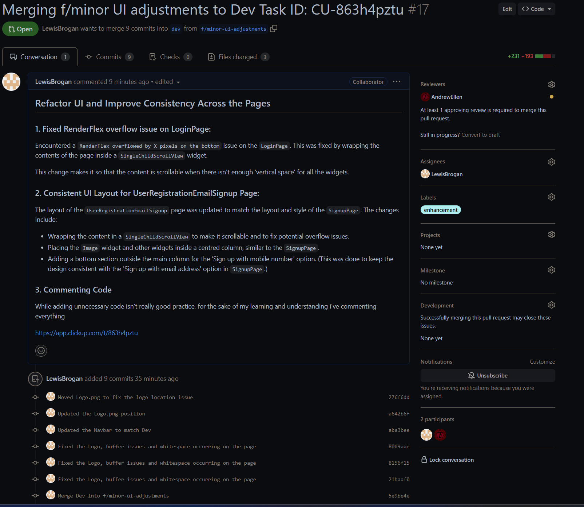
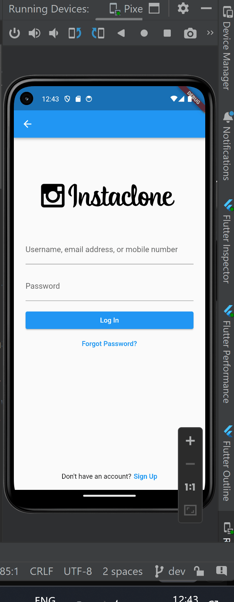
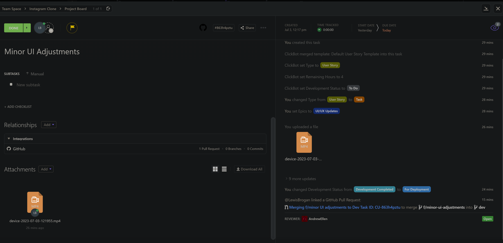

# 2023/07/03

### What I did today

Pull Request: https://github.com/AndrewEllen/instagram-clone/pull/17

Sent in a Pull Request that fixed some UI issues including:
- Renderflow Issues
- Consisistency layout between the pages
- Logo placement to match on all pages

### Evidence

### What I learned

Encountered an issue: 'RenderFlex overflowed by X pixels on the bottom issue on the `LoginPage`'. This was fixed by wrapping the contents of the page inside a `SingleChildScrollView` widget.

This change makes it so that the content is scrollable when there isn't enough 'vertical space' for all the widgets, removing the Renderflex Overflowed issue I had.

### What my plan going forward is

Look into a pipeline for the project

### Things to look at

### References

Merging f/minor UI adjustments to Dev Task ID: CU-863h4pztu [Online]. Available at: https://github.com/AndrewEllen/instagram-clone/pull/17 (Accessed: 03/07/2023).

https://app.clickup.com/t/863h4pztu - Minor UI Adjustments Task